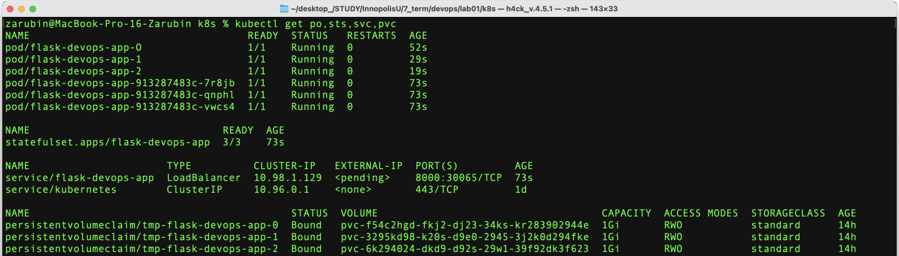
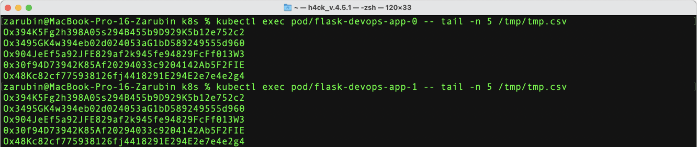

## output
no difference between outputs (but it can exist - all pods are writing to the same file - race conditions)

in our example, no order guarantee is required, because all applications have the same functionality and do not depend on each other

