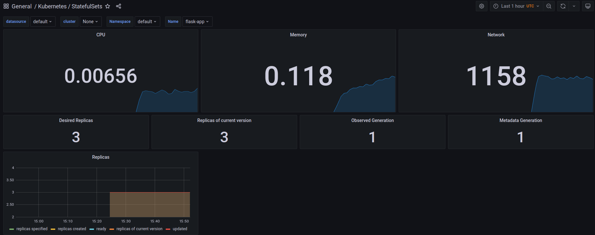
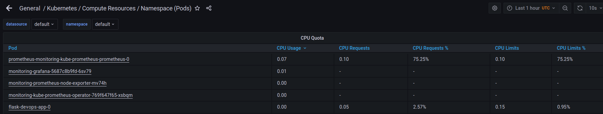
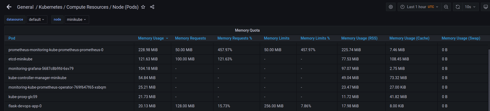
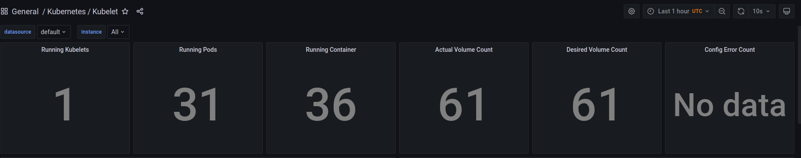
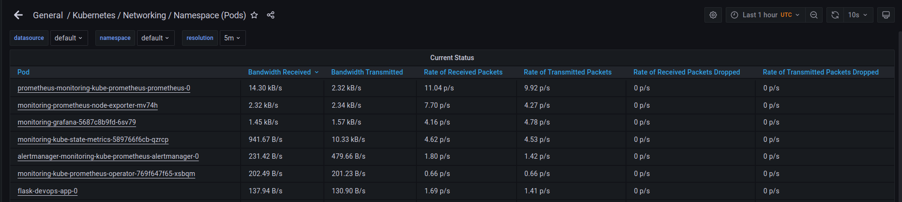
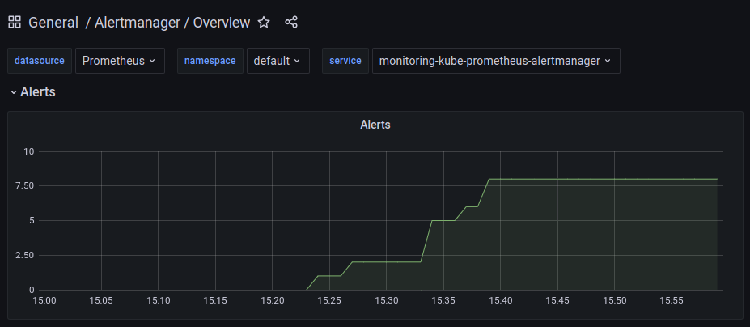

## stack components:

**The Prometheus Operator**

automates Prometheus deployment inside Kubernetes

**Highly available Prometheus**

Prometheus - time-series DB used to store TS data

**Highly available Alertmanager**

alert handling

**Prometheus node-exporter**

metrics collector for Prometheus

**Prometheus Adapter for Kubernetes Metrics APIs**

k8s metrics into prometheus format

**kube-state-metrics**

states of pods as metrics

**Grafana**

visualisation tool

```
zarubin@MacBook-Pro-16-Zarubin k8s % kubectl get po,sts,svc,pvc,cm
NAME                                                         READY   STATUS    RESTARTS   AGE
pod/alertmanager-monitoring-kube-prometheus-alertmanager-0   2/2     Running   0          2m52s
pod/flask-devops-app-0                                       1/1     Running   0          2m43s
pod/flask-devops-app-1                                       1/1     Running   0          2m13s
pod/flask-devops-app-2                                       1/1     Running   0          3m23s
pod/flask-devops-app-913287483c-jdow2                        1/1     Running   0          2m43s
pod/flask-devops-app-913287483c-vjqem                        1/1     Running   0          2m43s
pod/flask-devops-app-913287483c-d91jd                        1/1     Running   0          2m43s
pod/monitoring-grafana-5687c8b9fd-kd929                      2/2     Running   0          2m31s
pod/monitoring-kube-prometheus-operator-769f647f65-xkwok     1/1     Running   0          2m31s
pod/monitoring-kube-state-metrics-589766f6cb-djxow           1/1     Running   0          2m31s
pod/monitoring-prometheus-node-exporter-d29ei                1/1     Running   0          2m31s
pod/prometheus-monitoring-kube-prometheus-prometheus-0       2/2     Running   0          2m50s

NAME                                                                    READY   AGE
statefulset.apps/alertmanager-monitoring-kube-prometheus-alertmanager   1/1     2m52s
statefulset.apps/flask-devops-app                                       3/3     2m43s
statefulset.apps/prometheus-monitoring-kube-prometheus-prometheus       1/1     2m50s

NAME                                              TYPE           CLUSTER-IP       EXTERNAL-IP   PORT(S)                      AGE
service/alertmanager-operated                     ClusterIP      None             <none>        9093/TCP,9094/TCP,9094/UDP   2m52s
service/flask-devops-app                          LoadBalancer   10.103.28.150    <pending>     8000:30992/TCP               2m43s
service/kubernetes                                ClusterIP      10.96.0.1        <none>        443/TCP                      1d
service/monitoring-grafana                        ClusterIP      10.102.134.135   <none>        80/TCP                       2m31s
service/monitoring-kube-prometheus-alertmanager   ClusterIP      10.97.102.120    <none>        9093/TCP                     2m31s
service/monitoring-kube-prometheus-operator       ClusterIP      10.102.51.19     <none>        443/TCP                      2m31s
service/monitoring-kube-prometheus-prometheus     ClusterIP      10.107.233.81    <none>        9090/TCP                     2m31s
service/monitoring-kube-state-metrics             ClusterIP      10.103.166.40    <none>        8080/TCP                     2m31s
service/monitoring-prometheus-node-exporter       ClusterIP      10.109.176.129   <none>        9100/TCP                     2m31s
service/prometheus-operated                       ClusterIP      None             <none>        9090/TCP                     2m50s

NAME                                           STATUS   VOLUME                                     CAPACITY   ACCESS MODES   STORAGECLASS   AGE
persistentvolumeclaim/tmp-flask-devops-app-0   Bound    pvc-f54c2hgd-fkj2-dj23-34ks-kr283902944e   1Gi        RWO            standard       18h
persistentvolumeclaim/tmp-flask-devops-app-1   Bound    pvc-3295kd98-k20s-d9e0-2945-3j2k0d294fke   1Gi        RWO            standard       18h
persistentvolumeclaim/tmp-flask-devops-app-2   Bound    pvc-6k294024-dkd9-d92s-29w1-39f92dk3f623   1Gi        RWO            standard       18h

NAME                                                                     DATA   AGE
configmap/config-app                                                     1      2m43s
configmap/kube-root-ca.crt                                               1      1d
configmap/monitoring-grafana                                             1      2m31s
configmap/monitoring-grafana-config-dashboards                           1      2m31s
configmap/monitoring-grafana-test                                        1      2m31s
configmap/monitoring-kube-prometheus-alertmanager-overview               1      2m31s
configmap/monitoring-kube-prometheus-apiserver                           1      2m31s
configmap/monitoring-kube-prometheus-cluster-total                       1      2m31s
configmap/monitoring-kube-prometheus-controller-manager                  1      2m31s
configmap/monitoring-kube-prometheus-etcd                                1      2m31s
configmap/monitoring-kube-prometheus-grafana-datasource                  1      2m31s
configmap/monitoring-kube-prometheus-k8s-coredns                         1      2m31s
configmap/monitoring-kube-prometheus-k8s-resources-cluster               1      2m31s
configmap/monitoring-kube-prometheus-k8s-resources-namespace             1      2m31s
configmap/monitoring-kube-prometheus-k8s-resources-node                  1      2m31s
configmap/monitoring-kube-prometheus-k8s-resources-pod                   1      2m31s
configmap/monitoring-kube-prometheus-k8s-resources-workload              1      2m31s
configmap/monitoring-kube-prometheus-k8s-resources-workloads-namespace   1      2m31s
configmap/monitoring-kube-prometheus-kubelet                             1      2m31s
configmap/monitoring-kube-prometheus-namespace-by-pod                    1      2m31s
configmap/monitoring-kube-prometheus-namespace-by-workload               1      2m31s
configmap/monitoring-kube-prometheus-node-cluster-rsrc-use               1      2m31s
configmap/monitoring-kube-prometheus-node-rsrc-use                       1      2m31s
configmap/monitoring-kube-prometheus-nodes                               1      2m31s
configmap/monitoring-kube-prometheus-persistentvolumesusage              1      2m31s
configmap/monitoring-kube-prometheus-pod-total                           1      2m31s
configmap/monitoring-kube-prometheus-prometheus                          1      2m31s
configmap/monitoring-kube-prometheus-proxy                               1      2m31s
configmap/monitoring-kube-prometheus-scheduler                           1      2m31s
configmap/monitoring-kube-prometheus-statefulset                         1      2m31s
configmap/monitoring-kube-prometheus-workload-total                      1      2m31s
configmap/prometheus-monitoring-kube-prometheus-prometheus-rulefiles-0   28     2m52s
```

### StatefulSets


### cpu


### memory


### kubelet


### networking


### alerts


## Container

```
zarubin@MacBook-Pro-16-Zarubin k8s % kubectl exec pod/flask-devops-app-0 -- cat /inittest/index.html
Defaulted container "flask-devops-app" out of: flask-devops-app, install (init)
<html><head></head><body><header>
<title>http://info.cern.ch</title>
</header>

<h1>http://info.cern.ch - home of the first website</h1>
<p>From here you can:</p>
<ul>
<li><a href="http://info.cern.ch/hypertext/WWW/TheProject.html">Browse the first website</a></li>
<li><a href="http://line-mode.cern.ch/www/hypertext/WWW/TheProject.html">Browse the first website using the line-mode browser simulator</a></li>
<li><a href="http://home.web.cern.ch/topics/birth-web">Learn about the birth of the web</a></li>
<li><a href="http://home.web.cern.ch/about">Learn about CERN, the physics laboratory where the web was born</a></li>
</ul>
</body></html>
```