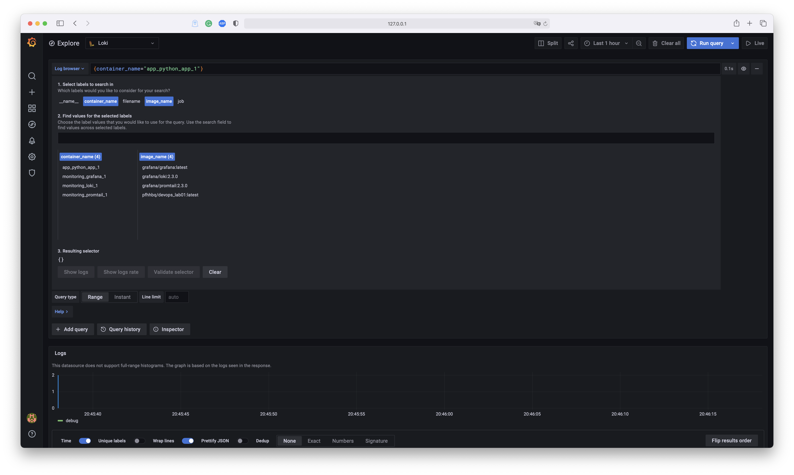
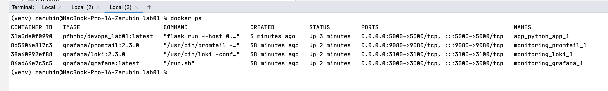
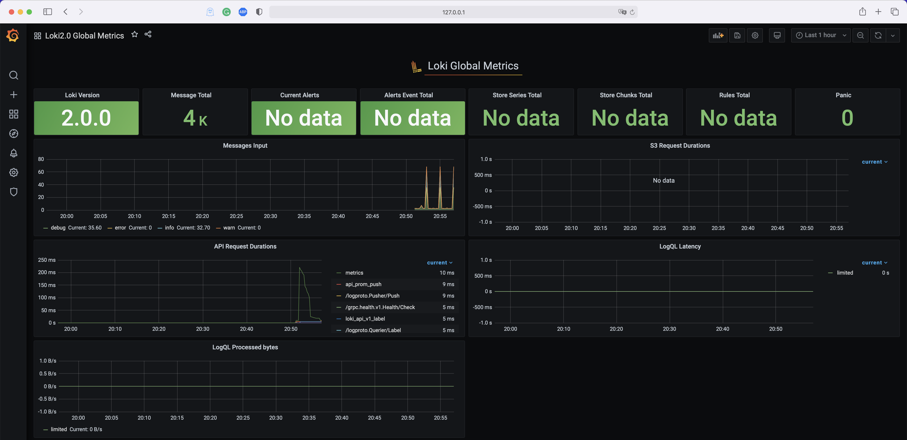
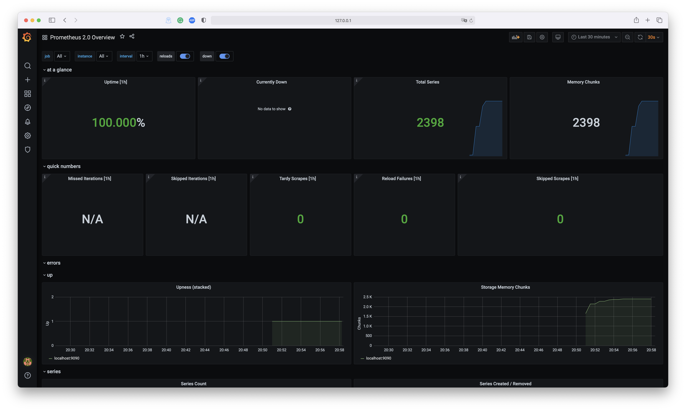
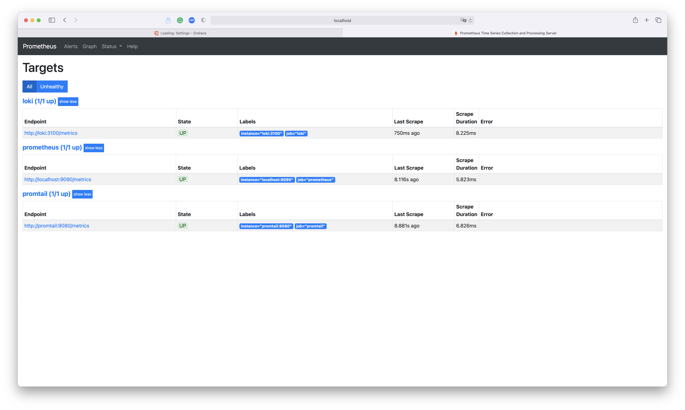

### **🖼 Screenshots**

 ### **Logging 💯 practices**
 - upload logs to some storage
 - do log rotation
 - make sure new dashboard has a meaningful name after creating 
 - use one format log
 - use common log format for apps for simple log searching
 - check logs for secret data